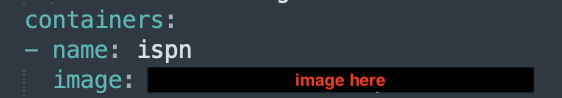
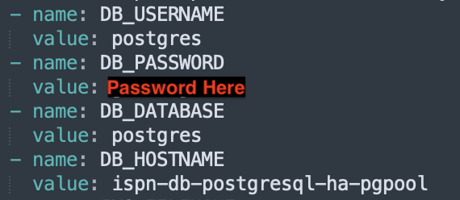
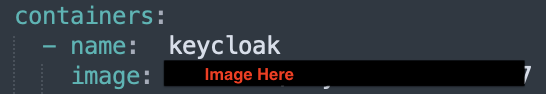
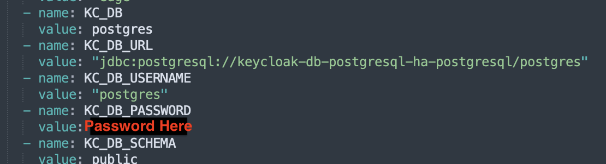

# keycloak

## Prerequisites
* Docker installed
* Minikube installed

## Run Kubernetes
\# Start local Kubernetes cluster  
`minikube start` 
`minikube addons enable ingress`  

\# Add helm repo bitnami and ingress  
`helm repo add bitnami https://charts.bitnami.com/bitnami` 
`helm repo add ingress-nginx https://kubernetes.github.io/ingress-nginx` 

\# Install ingress-nginx on Kubernetes cluster  
`helm install ingress-nginx -n ingress-nginx --create-namespace ingress-nginx/ingress-nginx` 

\# Create separate namespace for keycloak  
`kubectl create ns keycloak` 

\# Apply config map  
`kubectl apply -f cm.yml` 

## Install Infinispan Cluster
\# Make docker build  
`docker build -t my_repo/ispn:version .` 
`docker push my_repo/ispn:version`

\# Use created and pushed image in deployment  

\# Install postgres database on Kubernetes cluster for infinispan  
`helm install -n keycloak ispn-db bitnami/postgresql-ha --set postgresql.replicaCount=1`
\# To export db password  
`export POSTGRES_PASSWORD=$(kubectl get secret --namespace keycloak ispn-db-postgresql-ha-postgresql -o jsonpath="{.data.password}" | base64 -d)`  
`echo $POSTGRES_PASSWORD`  
then put dabase password like shown on below picture

\# Apply deployment and service of infinispan (navigate to ispn catalog)  
`kubectl apply -f infinispan-deployment.yaml` 
`kubectl apply -f infinispan-service.yaml` 

## Install Keycloak Cluster
\# Make docker build  
`docker build -t my_repo/keycloak:version .` 
`docker push my_repo/keycloak:version`

\# Use created and pushed image in deployment  

\# Generate key and cert for ssl communication with keycloak  
`openssl req -x509 -sha256 -nodes -days 365 -newkey rsa:2048 -keyout auth-tls.key -out auth-tls.crt -subj "/CN=auth.localtest.me/O=keycloak"` 

\# Put key and cert on secret space on Kubernetes  
`kubectl create secret -n keycloak tls auth-tls-secret --key auth-tls.key --cert auth-tls.crt` 

\# Install postgres database on Kubernetes cluster for keycloak 
`helm install -n keycloak keycloak-db bitnami/postgresql-ha --set postgresql.replicaCount=1`

\# To export db password  
`export POSTGRES_PASSWORD=$(kubectl get secret --namespace keycloak keycloak-db-postgresql-ha-postgresql -o jsonpath="{.data.password}" | base64 -d)`  
`echo $POSTGRES_PASSWORD`  
then put dabase password like shown on below picture

\# Apply deployment and service of infinispan (navigate to ispn catalog)  
`kubectl apply -f keycloak-deployment.yaml` 
`kubectl apply -f keycloak-ingress.yaml -n keycloak` 

